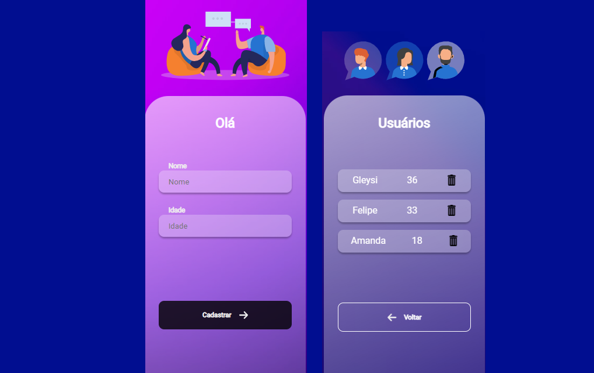

<h2 align="center">
  Primeiro Projeto React
</h2>

## ✅ Sobre o projeto

<b>A aplicação é uma área de cadastro onde registra o nome e a idade do usuário através do Front-End conectado como Back-End.</b>

A aplicação conta com duas paginas onde utiliza React.js no front-end e Node.js no back-end.

## :rocket: Tecnologias ##

Neste projeto foram utilizadas as seguintes ferramentas:

- [Html](https://pt.wikipedia.org/wiki/HTML)
- [Css](https://developer.mozilla.org/pt-BR/docs/Web/CSS)
- [JavaScript](https://developer.mozilla.org/pt-BR/docs/Web/JavaScript)
- [NodeJs](https://nodejs.org/en/)
- [React](https://pt-br.reactjs.org/)

## 🤝 Colaboradores
Agradecemos às seguintes pessoas que contribuíram para este projeto:

<table>
  <tr>
    <td align="center">
         
        
          <b>Gleysi Ferreira</b>
        
      </a>
    </td>           
   </tr>
</table>

## 📝 License

This project is under license. See the [LICENSE](LICENSE.md) file for more details.

&#xa0;

<a href="#top">Back to top</a>
